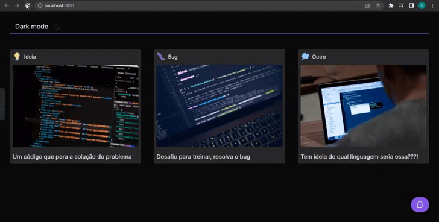
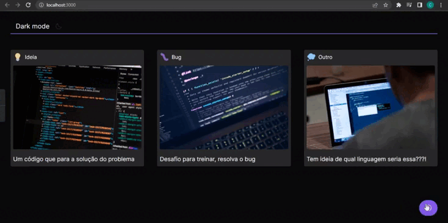

 <a href="#sobre">Sobre</a> •
 <a href="#aprendizados">Aprendizados</a> •
 <a href="#extras">Extras</a> •
 <a href="#tecnologias">Tecnologias</a> •
 <a href="#instalacao">Instalação</a> 

  <h1>📎 Sobre. </h1>
  
O projeto feedback foi desenvolvido na 8º edição do evento nlw fornecido pela <a href="https://www.rocketseat.com.br/">Rocketseat</a>. Nessa edição
  foi feito um sistema de widget completo e acessível que pode ser aplicado em qualquer sistema para capturar feedbacks dos usuários. Durante todo o evento
   foi abordado conceitos importante de react e boas práticas de código.<b> Após a conclusão do evento foram adicionadas funcionalidades novas a fim de levar a aplicação
  para um próximo nível e aprofundar ainda mais os conceitos adiquiridos, você pode vê-lás <a href="extras">aqui</a>.</b>

 <h1>📚 Aprendizados. </h1>
 <ul>
  <li>Boas práticas de código, layout e organização.</li>
  <li>Acessibilidade em componentes.</li>
  <li>Tipagem próprias do react e personalizadas no typescript.</li>
  <li>Utilização de bibliotecas.</li>
  <li>Conceitos básicos de tailwind .</li>
  <li>Servidor local com o mirageJs.</li>
  <li>Eslint & Prettier.</li>
 </ul>

  

  <h1>🚀 Extras. </h1>
  <ul>
    <li>
      <h3>MirageJs</h3>
      

      
O mirageJs é uma biblioteca para simulação de uma API que permite criar, testar e compartilhar um aplicativo completo 
        e funcional sem precisar depender de nenhum serviço de back-end. Como o foco foi somente nas aulas de react, optei por usar o mirageJs. 
        Ele foi configurado para vir com alguns dados pré-cadastrado para simular a listagem de feedbacks já enviados.
      

    </li>
    <li>
      <h3>Dark mode</h3>
      

      
Troca de temas no aplicativo com o tailwind. O usuário pode alterar em a versão normal, light, e a versão dark criada por mim.

    </li>
    <li>
      <h3>Eslint & Prettier</h3>
        
Ambos foram instalados com o objetivo de padronizar e organizar o código.

    </li>
  <ul>
    

    
 

  <h1>🛠 Tecnologias.</h1>
  

    
    
    
    
    
   

    

   <h1>ℹ️ Instalação.</h1>
  <ul>
    <li>
      
Clone o projeto e acesse a pasta do mesmo.

      <code>
          $ git clone https://github.com/souzzs/feedback-widget.git
      </code>
    </li>
    <li>
      
Instale as dependências

      <code>
          $ npm install
      </code>
    </li>
    <li>
      
Inicie o projeto

      <code>
          $ npm start
      </code>
    </li>
  </ul>

    

  <h1>✏️ Autor.</h1>
  
Desenvolvimento por <a href="https://github.com/souzzs">Caio Souza</a>. & Ideia por <a href="https://www.rocketseat.com.br/">Rocketseat</a>.

  

    
    
    
  

